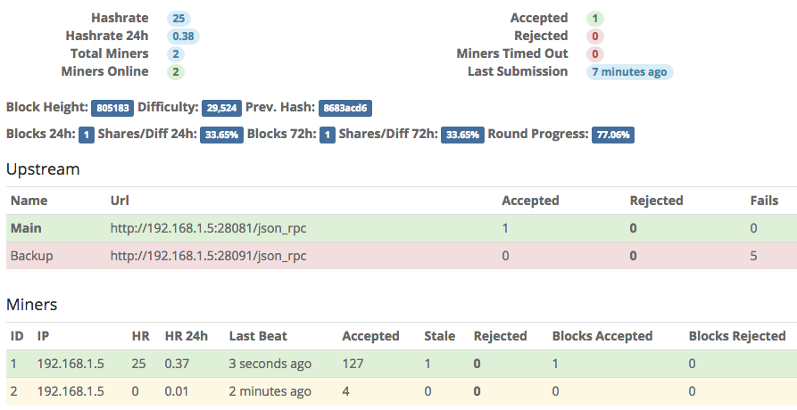

WAZN Stratum
======================

WORK IN PROGRESS: cnutil, hashing, pool, rpc, stratum, util ---> check again when [wazn-node-hashing](https://github.com/vermin/wazn-node-hashing) is complete.

[](https://opensource.org/licenses/GPL-2.0)

High performance WAZN mining stratum with Web-interface written in Golang.

**Stratum feature list:**

* Be your own pool
* Rigs availability monitoring
* Keep track of accepts, rejects, blocks stats
* Easy detection of sick rigs
* Daemon failover list
* Concurrent shares processing
* Beautiful Web-interface



## Installation

Dependencies:

  * go-1.6
  * Everything required to build WAZN
  * WAZN >= **v1.0.0**

### Linux

Use Ubuntu 16.04 or 18.04.

Compile WAZN from source (with shared libraries option):

Debian / Ubuntu one liner for all dependencies:  
``` sudo apt update && sudo apt install git build-essential cmake libboost-all-dev miniupnpc libunbound-dev graphviz doxygen libunwind8-dev pkg-config libssl-dev libcurl4-openssl-dev libreadline-dev libzmq3-dev libsodium-dev libhidapi-dev libhidapi-libusb0 liblzma-dev libexpat1-dev libpgm-dev libldns-dev libreadline6-dev qttools5-dev-tools libusb-dev libprotobuf-dev protobuf-compiler ```

    git clone --recursive https://github.com/project-wazn/wazn.git
    cd wazn
    cmake -DBUILD_SHARED_LIBS=1 .
    make

Install Golang and required packages:

    sudo apt-get install golang

Clone stratum:

    git clone https://github.com/vermin/wazn-stratum.git
    cd wazn-stratum

Build stratum:

    WAZN_DIR=/path/to/wazn cmake .
    make

`WAZN_DIR=/path/to/wazn` is optional, not needed if both `wazn` and `wazn-stratum` is in the same directory like `/opt/src/`. By default make will search for WAZN libraries in `../wazn`. You can just run `cmake .`.

### Mac OS X

Compile WAZN source:

    git clone --recursive https://github.com/project-wazn/wazn.git
    cd wazn
    cmake .
    make

Install Golang and required packages:

    brew update && brew install go

Clone stratum:

    git clone https://github.com/vermin/wazn-stratum.git
    cd wazn-stratum

Build stratum:

    WAZN_DIR=/path/to/wazn cmake .
    make

### Running Stratum

    ./build/bin/wazn-stratum config.json

If you need to bind to privileged ports and don't want to run from `root`:

    sudo apt-get install libcap2-bin
    sudo setcap 'cap_net_bind_service=+ep' /path/to/wazn-stratum

## Configuration

Configuration is self-describing, just copy *config.example.json* to *config.json* and run stratum with path to config file as 1st argument.

```javascript
{
  // Address for block rewards
  "address": "YOUR-ADDRESS-NOT-EXCHANGE",
  // Don't validate address
  "bypassAddressValidation": true,
  // Don't validate shares
  "bypassShareValidation": true,

  "threads": 2,

  "estimationWindow": "15m",
  "luckWindow": "24h",
  "largeLuckWindow": "72h",

  // Interval to poll daemon for new jobs
  "blockRefreshInterval": "1s",

  "stratum": {
    // Socket timeout
    "timeout": "15m",

    "listen": [
      {
        "host": "0.0.0.0",
        "port": 1111,
        "diff": 5000,
        "maxConn": 32768
      },
      {
        "host": "0.0.0.0",
        "port": 3333,
        "diff": 10000,
        "maxConn": 32768
      }
    ]
  },

  "frontend": {
    "enabled": true,
    "listen": "0.0.0.0:8082",
    "login": "admin",
    "password": "",
    "hideIP": false
  },

  "upstreamCheckInterval": "5s",

  "upstream": [
    {
      "name": "Main",
      "host": "127.0.0.1",
      "port": 11787,
      "timeout": "10s"
    }
  ]
}
```

You must use `anything.WorkerID` as username in your miner. Either disable address validation or use `<address>.WorkerID` as username. If there is no workerID specified your rig stats will be merged under `0` worker. If mining software contains dev fee rounds its stats will usually appear under `0` worker. This stratum acts like your own pool, the only exception is that you will get rewarded only after block found, shares only used for stats.

## License
```
Licensed under the GPL-2.0
Copyright (c) 2019 WAZN Project
Copyright (c) 2017-2019 sammy007
```
